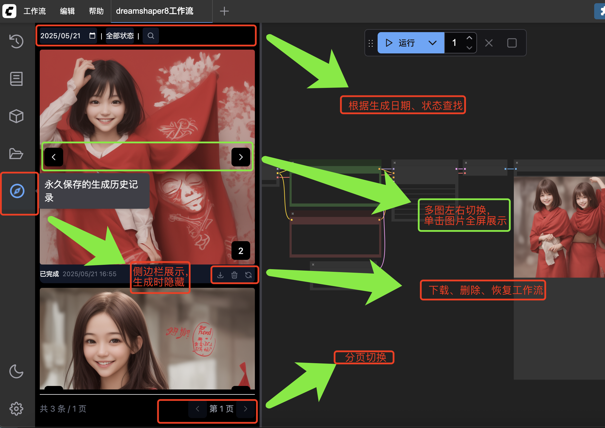

# ComfyUI-Bt-ArtifactGround

一个用于保存和管理 ComfyUI 生成记录的插件。

ComfyUI 构建物广场，永久存储 ComfyUI 的生成记录，防止重启或超数量后 Queue 被清空导致无法找回历史生成。

## 解决核心问题
ComfyUI队列重启或超过阈值数量后自动清空，历史生成记录无法查找的问题

## 使用截图



## 功能特点

- 自动保存生成的图片和相关参数
- 提供侧边栏界面查看历史生成记录
- 支持按日期和状态筛选记录
- 支持查看详细的生成参数和元数据
- 支持下载生成的图片
- 无限滚动加载更多记录
- 实时状态更新（处理中/已完成/失败）
- 响应式布局，适配不同屏幕尺寸

## 安装方法

1. 进入 ComfyUI 的 custom_nodes 目录
```bash
cd custom_nodes
```

2. 克隆本仓库
```bash
git clone https://github.com/samuelzuuka/ComfyUI-Bt-ArtifactGround.git
```

3. 安装依赖(可省略)..重启会自动安装
```bash
cd ComfyUI-Bt-ArtifactGround
pip install -r requirements.txt
```

4. 重启 ComfyUI 服务

## 使用方法

1. 启动 ComfyUI 后，左侧菜单栏会出现"构建记录"选项
2. 点击打开历史记录界面
3. 所有的生成记录会自动保存，无需额外操作
4. 可以通过以下方式管理记录：
   - 使用日期选择器筛选特定日期的记录
   - 使用状态下拉框筛选不同状态的记录
   - 点击眼睛图标查看详细信息
   - 点击下载图标下载生成的图片
   - 滚动到底部自动加载更多记录

## 数据存储

- 图片文件保存在 ComfyUI 的 output 目录
- 生成记录保存在插件目录下的 SQLite 数据库中
- 数据库文件：artifacts.db
- 记录字段包括：
  - ID：唯一标识符
  - 创建时间：记录创建的时间戳
  - 状态：处理中(0)/已完成(1)/失败(2)
  - 提示词：生成使用的参数
  - 元数据：其他相关信息
  - 输出：生成的图片信息

## API 接口

### 获取历史记录列表
- 路径：POST `/bt/artifacts/list`
- 参数：
  ```json
  {
    "date": "YYYY-MM-DD",  // 可选，按日期筛选
    "status": "0|1|2",     // 可选，按状态筛选
    "limit": 20,           // 每页数量
    "offset": 0            // 分页偏移
  }
  ```
- 响应：
  ```json
  {
    "code": 0,
    "msg": "success",
    "data": [
      {
        "id": "xxx",
        "created_at": "2024-03-21 10:00:00",
        "result_status": "1",
        "outputs": {},
        "prompt": {},
        "meta": {}
      }
    ]
  }
  ```

### 获取记录详情
- 路径：GET `/bt/artifacts/{id}`
- 响应：
  ```json
  {
    "code": 0,
    "msg": "success",
    "data": {
      "id": "xxx",
      "created_at": "2024-03-21 10:00:00",
      "result_status": "1",
      "outputs": {},
      "prompt": {},
      "meta": {}
    }
  }
  ```

## 开发说明

### 项目结构
```
ComfyUI-Bt-ArtifactGround/
├── __init__.py           # 插件入口
├── api.py               # API接口实现
├── btmiddleware.py      # 中间件和路由
├── database/            # 数据库相关
│   ├── manager.py      # 数据库管理
│   └── models/         # 数据模型
├── js/                 # 前端文件
│   ├── main.js        # 主入口
│   ├── artifact-list.js # 列表组件
│   └── common.js      # 公共函数
├── requirements.txt     # 依赖列表
└── README.md           # 说明文档
```

## 更新日志

### v1.1.0 (2024-03-22)
- 重构前端代码，提升性能
- 优化界面布局，适配侧边栏
- 添加无限滚动加载
- 完善错误处理和用户提示
- 规范化 API 接口

### v1.0.0 (2024-03-21)
- 初始版本发布
- 基本功能实现

## 许可证

MIT License 